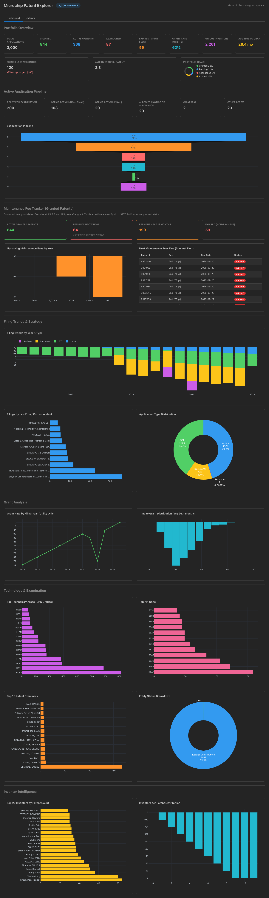
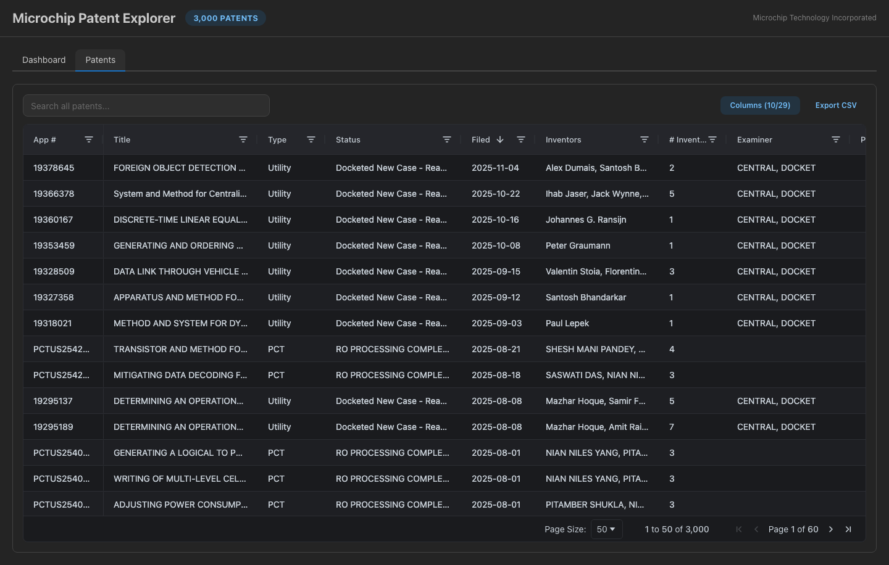

# Microchip Patent Explorer

A full-stack patent portfolio analytics dashboard for **Microchip Technology Incorporated**, built from raw USPTO Patent Examination Data System (PEDS) data.

| Metric | Value |
|--------|-------|
| Total Applications | 3,000 |
| Granted Patents | 844 |
| Active / Pending | 368 |
| Abandoned | 87 |
| Grant Rate (Utility) | 62% |
| Unique Inventors | 2,261 |
| Avg Time to Grant | 26.4 months |

---

## Dashboard

Interactive analytics with KPIs, pipeline tracking, maintenance fee alerts, filing trends, grant analysis, technology breakdowns, and inventor intelligence.



---

## Patents Database

Searchable, sortable AG Grid table with 29 toggleable columns, filters, and CSV export across all 3,000 patent applications.



---

## Features

- **Portfolio Overview** - 8 KPI cards with grant rate, filing activity, and health ring chart
- **Active Pipeline** - Examination stage funnel (Ready for Exam, Office Actions, Allowance, Appeal)
- **Maintenance Fee Tracker** - Upcoming fee windows at 3.5, 7.5, and 11.5 years post-grant
- **Filing Trends** - Stacked bar charts by year and application type (Utility, PCT, Provisional, Re-Issue)
- **Grant Analysis** - Grant rate by filing year, time-to-grant distribution
- **Technology & Examination** - Top CPC groups, art units, examiners, entity status
- **Inventor Intelligence** - Top inventors, inventors-per-patent distribution
- **Law Firm Analysis** - Filing volume by correspondence firm
- **Full Patent Table** - AG Grid with search, column toggle, pagination, CSV export

---

## Tech Stack

| Layer | Technology |
|-------|-----------|
| Backend | Python, Flask, Flask-CORS |
| Frontend | React 19, TypeScript |
| UI Components | Mantine v8 |
| Data Table | AG Grid Community v35 |
| Charts | Plotly.js + react-plotly.js |
| Build Tool | Vite 7 |
| Theme | Dark mode |

---

## Getting Started

### Backend

```bash
cd backend
python3 -m venv venv
source venv/bin/activate
pip install -r requirements.txt
python app.py
```

Runs on http://localhost:5002

### Frontend

```bash
cd frontend
npm install
npm run dev
```

Runs on http://localhost:5173

---

## Project Structure

```
Microchip/
├── backend/
│   ├── app.py                # Flask API server + data cleaning
│   └── requirements.txt
├── frontend/
│   ├── src/
│   │   ├── App.tsx           # Main app shell (tabs)
│   │   ├── api.ts            # API client
│   │   ├── types.ts          # TypeScript interfaces
│   │   ├── main.tsx          # React entry point
│   │   └── components/
│   │       ├── Dashboard.tsx  # Analytics dashboard
│   │       ├── PatentTable.tsx# AG Grid patent table
│   │       ├── Charts.tsx     # Plotly chart components
│   │       └── StatsCards.tsx # Summary KPI cards
│   ├── package.json
│   ├── vite.config.ts
│   └── index.html
├── microchip.json            # USPTO raw patent data (3,000 records)
├── docs/images/              # Screenshots
└── README.md
```

---

## API Endpoints

| Endpoint | Description |
|----------|-------------|
| `GET /api/patents` | Returns all 3,000 cleaned patent records |
| `GET /api/stats` | Returns aggregated statistics (by type, status, year, top inventors) |
